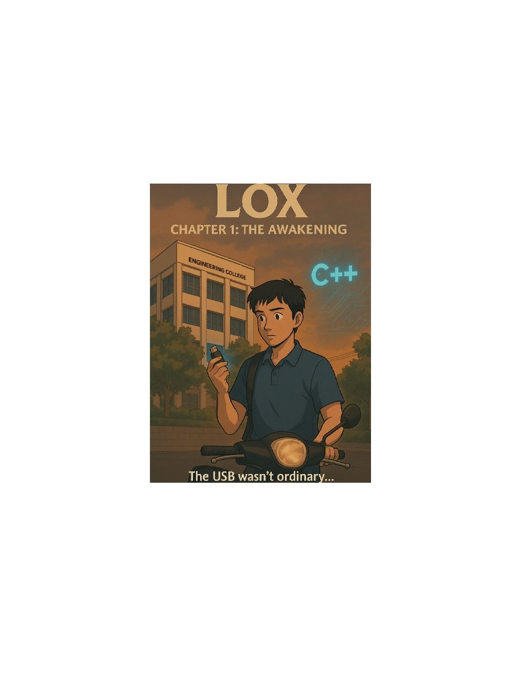

Control Flow

------------------------------------------------------------------------------
																			 |
### 8.2 — If statements and blocks											 |
																			 |
------------------------------------------------------------------------------

## New things I learned

- always use blocks in for condition statment control flow body, bcz, if/else without block/braces only include very next single statement.
- using { } will make include all required statements, better for readability.
- dont accidently put ';' beside conditions, it will assume as null statement and will always execute next line.


- Implicit Blocks

				|	Idea: Neenga curly braces podala na kuda, C++ compiler internal-a oru "invisible block" create pannikum for that single line.
				|
				|	Definition: Single statement-ku braces optional, but readability-ku braces podradhu dhaan best practice.
				|


	Basic If: Simple check.

	Else: Alternative action.

	If / Else If / Else Chain: Checking multiple conditions; only the first "true" block runs.

	Null Statement: Semicolon error (;).

	Block Statements: Using { } for multiple lines.

	Implicit Blocks: Invisible { } for single lines.

	Nested If: if inside an if (Dangling else problem).

	Variable Scope: Variables inside { } die when the block ends.

	Redeclaration: Cannot define the same name twice in one scope.

	Assignment: Updating an existing variable's value using =.

	Compile-time: The planning/building stage (where comments/whitespace are ignored).

	Runtime: The execution/action stage.

	Variable Shadowing: Inner variable hiding an outer one.

	Initializers in If: Defining a variable inside if (C++17).

	Indentation: Visual hierarchy (ignored by compiler).

	Early Returns: Exiting early to avoid nesting and keep code flat.

	Unreachable Code: Code after a return statement that never runs.

	Arrow Code: Bad practice (>) shape caused by deep nesting.

	Braces Safety: Always using { } even for single lines to prevent bugs.

	Indentation Trap: Code that looks conditional due to spacing but always executes.

	Comment-out & Stealing Bug: In a condition without braces, commenting out the body at the end of a chain (or standalone if) steals the 
								next outer statement—regardless of distance or blank lines.
								Commenting in the middle of a chain (before an else) causes a Compiler Error.


								Quick Reason why distance doesn't matter: 

								The compiler treats your code like a continuous stream of text. 
								When it hits an if without braces, it looks for the very next "active" instruction. 
								Since it deletes all comments and blank lines during the first step of compilation, 
								a line 100 lines down looks like it's right next to the if to the compiler.
								
	Single-Line Conditional Method: Placing the statement on the same line (e.g., if (x) doY();). 
									
									Pros: 
									Prevents the Comment-out Bug (commenting the line removes the whole if) and keeps code compact. 
									Cons: 
									Harder to debug because the conditional and statement execute as one step, and you cannot place a breakpoint on just the action.


Types of if/else chaining usage:

1. If-Else (Exclusive Choice)
2. If-If (Multiple Checks)
3. If-If with Return (Early Exit)


	1. If-Else (Exclusive Choice)
	   
	   * It executes the code only after the first true condition it finds.

	   
	   * An else if statement only evaluates if the previous if statement was false.

	   
	   * Once it finds a true condition, it skips all remaining else blocks.

	   
	   * These statements are dependent on each other.


	2. If-If (Multiple Checks)
	   
	   * It executes the code after all true conditions.

	   
	   * Every single if statement in the list is evaluated by the computer.

	   
	   * One if statement being true does not stop the next one from checking.

	   
	   * These statements are independent of each other.


	3. If-If with Return (Early Exit)
	   
	   * A return statement causes a function to exit immediately.

	   
	   * If an if block contains a return, the function finishes as soon as that condition is true.

	   
	   * Because the function exits, any if statements following it never get a chance to run.

	   
	   * This makes independent if statements behave exactly like if-else.


	4. Dependency and Best Practices
	   
	   * When every branch returns a value, the else keyword provides no extra value.

	   
	   * Using if-if with returns avoids "clutter" in your code.

	   
	   * It allows your conditions to line up better, making the code easier to read.


- (will see later this advanced concept)

	Member Pointer Jump Table (.* and ->*): An alternative to if/else chains for class object decision-making where an array stores member function addresses; 
											this allows the program to "jump" directly to the correct logic at runtime using these operators, providing a faster 
											and more organized data structure for complex life cycles.


------------------------------------------------------------------------------

## Examples / Code I tried

[C++]


------------------------------------------------------------------------------

## Things that confused me


------------------------------------------------------------------------------

## Important notes / rules

- Best Practice : always use braces {} to create a block for the conditional cotrol flow body statements
- I did a mistake where unknowingly redeclared variable inside another scope without understanding scope, lifetime, duration. Now im clear.
- Be careful while Re-dec, it will cause again a new decalration which will die inside its relevant scope and the same outside variable will not be changed.


- If statement pakkadhula accidental-a semicolon (;) pota, adhu "null statement"-ah maaridun. C++ nenaikum "if condition mudinjiduchu" nu.
  Definition: Semicolon denotes the end of a statement. If condition kulla semicolon pota, condition true-ah irundhalum illatiyum adutha line run aagidum.


---------------------------------------------------------------------------------

## Quick summary (in my own words)


### Project Logic Overview
.


------------------------------------------------------------------------------------------------------------------------------------------------------------------
------------------------------------------------------------------------------------------------------------------------------------------------------------------
------------------------------------------------------------------------------------------------------------------------------------------------------------------


------------------------------------------------------------------------------
																			 |
### 8.3 — Common if statement problems									     |
																			 |
------------------------------------------------------------------------------

## New things I learned


- Nested if-statements and the dangling else problem
- Flattening nested if-statements
- Null statements
- use early return to avoid "Arrow code" i mean nested if/else


## Tabled Checklist

| No. | Concept / Problem | Technical Definition |
| :--- | :--- | :--- |
| **1** | **Dangling Else** | A logic error where an `else` pairs with the nearest preceding unmatched `if`. |
| **2** | **Semicolon Snag** | Accidental `;` after `if` creates an unconditional **Null Statement**. |
| **3** | **Arrow Code** | An anti-pattern of **Deep Nesting** that reduces code readability. |
| **4** | **Flattening Logic** | Refactoring nested code into a **Linear Structure** using operators. |
| **5** | **Guard Clauses** | Using **Early Returns** to handle failure cases first (Negative Validation). |
| **6** | **Initializers** | C++17 feature to declare variables inside `if` for **Scope Management**. |
| **7** | **Searchable Placeholders** | Using #define PASS to create intentional, searchable null statements.. |


## Consolidated Checklist

1. **The Dangling Else Ambiguity:** A logic error where an `else` statement is paired with the nearest preceding unmatched `if` statement in the same scope. 
									This occurs regardless of indentation, potentially leading to incorrect program behavior.

2. **The Semicolon Snag (Null Statements):** The accidental placement of a semicolon (`;`) immediately following an `if` condition. 
											This creates a null statement as the body of the `if`, causing the subsequent block of code to execute unconditionally (it runs every time, regardless of the condition).

3. **Arrow Code (Deep Nesting):** An anti-pattern in programming where multiple levels of nested `if` statements create a code structure that shifts further and further to the right, resembling a `>` shape.
                                  This significantly reduces code readability and increases complexity.

4. **Logic Flattening:** The process of refactoring deeply nested code into a linear, sequential structure. 
						 This is achieved by using Logical Operators (`&&`, `||`) to combine conditions or by restructuring the logic to handle cases one after another rather than one inside another.

5. **Guard Clauses (Negative Validation):** A technique used to flatten logic by checking for "failure" or "exit" conditions first. 
											By using an Early Return to exit the function if a condition isn't met, the "success path" of the code remains at the top level (flat) rather than being nested deep inside an `else` block.

6. **C++17 If-Statement Initializers:** A syntax feature that allows you to declare and initialize a variable directly within the `if` statement (e.g., `if (int x{ getVal() }; x > 0)`). 
										This restricts the variable's scope to the `if` and its associated `else` blocks, preventing variable leaks into the rest of the function.

7. Searchable Placeholders: Using #define PASS to create intentional, searchable null statements.


8.to be aware wth Operator== vs Operator= inside the conditional 


------------------------------------------------------------------------------------------------------------------------------------------------------------------
------------------------------------------------------------------------------------------------------------------------------------------------------------------
------------------------------------------------------------------------------------------------------------------------------------------------------------------


------------------------------------------------------------------------------
																			 |
### 8.4 — Constexpr if statements    									     |
																			 |
------------------------------------------------------------------------------

### Project Logic Overview


## New things I learned

* maybe if constexpr looks useless for a logic, but we can use it to discard the temp block logic and use it in future just by changing it to non-constant if statement
  as looking it as a reference. 
  
  for eg: temporarily we are disabling the logic instead of removing the logic from code. in future, if we need, we can enable


* constexpr if statement looks always for constant value whether the var got initialized from outside or inside if conditional.

* as we using if constexpr, the compiler will not generate machine code for the discarded branch


~~~~~~~~~~~~~~~~~~~~~~~~~
----- * CHECKLIST * -----
~~~~~~~~~~~~~~~~~~~~~~~~~


Compile-time Evaluation: 
The condition must be a constant expression (literals or constexpr variables) known when the code is built.


Discarded Statement: 
The branch not taken is "pruned." The compiler generates zero machine code for it, making the .exe smaller.


Zero Runtime Cost: 
No "if-check" happens while the program is running; the decision is already baked into the binary.


Syntactic Validity: 
Even discarded code must have correct C++ syntax. The compiler still "reads" it even if it doesn't "translate" it.


Template Non-instantiation: 
In templates, it allows code that would be "illegal" for certain types to exist without causing a crash.


C++17 Requirement: 
This is a modern standard feature and won't work on older C++11/14 setups.


Future-Proof Maintenance (User's Point! 💡): 
The discarded block stays in your source code as a dormant reference. You can easily "activate" it later by changing the constexpr value without rewriting logic.


if constexpr vs #if (The Safety Rule):

#if is a Preprocessor Macro (dumb text-cutter; doesn't check for errors).

if constexpr is a Compiler Feature (smart; respects scopes and checks for syntax errors). Unlike #if, if constexpr respects C++ scoping rules {}.


Preprocessor Masking ("the Dumb shredder): 
The ability of #if to completely hide code blocks from the compiler as if they never existed.
Why it's called a "Dumb Shredder"???: It is considered "dumb" because it does not understand C++ code; it only understands text.


------------------------------------------------------------------------------------------------------------------------------------------------------------------
------------------------------------------------------------------------------------------------------------------------------------------------------------------
------------------------------------------------------------------------------------------------------------------------------------------------------------------


------------------------------------------------------------------------------
																			 |
### 8.5 — Switch statement basics   									     |
																			 |
------------------------------------------------------------------------------

### Project Logic Overview


## New things I learned


* switch statement case labels are a continguous execution action as per the start of its conditional equality value. if there isn't any break, the cases will be executed continously
* switch's parantheses value should always be integral value
* case labels cannot be duplicated.
* char in case label stores the ascii value of given char
* placing default in top before the case labels wont affect the logic, bcz, switch executes as per the jumping strategy to the exact known case. 
* Always prefer default label to use in bottom of the switch block.
* If the value of the conditional expression does not match any of the case labels, and no default case has been provided, then no cases inside the switch are executed. Execution continues after the end of the switch block
* if there is no matching expr based on the switchs () and no default label, then the switch statement was skipped and the next line will be executed.
* beware while using 'return' and 'break' in switch labels. 
* 'return' in switch exits whole function, whereas 'break' in switch exits its current switch block but not exits from whole function.
* A break statement (declared using the break keyword) tells the compiler that we are done executing statements within the switch, and that execution should continue with the statement
  after the end of the switch block. This allows us to exit a switch-statement without exiting the entire function.
*  switch labels with indentation makes code complex in readability. Prefer not to indent labels. 
* Prefer a switch-statement over if-else statements when testing a single expression (with a non-boolean integral type or an enumerated type) for equality against a small set of values.


------------------------------------------------------------------------------------------------------------------------------------------------------------------
------------------------------------------------------------------------------------------------------------------------------------------------------------------
------------------------------------------------------------------------------------------------------------------------------------------------------------------


------------------------------------------------------------------------------
																			 |
### 8.6 — Switch fallthrough and scoping								     |
																			 |
------------------------------------------------------------------------------

### Project Logic Overview


## New things I learned

* we can use [[fallthrough]] attribute (C++ 17 feature) and we say this fallthrough is intentional so other devs could acknowledge
* everything inside switch {} falls under switch's scope. if specific scope needed inside, use {} block scope
* Sequential Case Labels (Stacking) is not considered as fallthrough
* if the fallthrough is intentional, use use [[fallthrough]] attribute 
* variable intialization will work only for last case label whether it is a 'case' or 'default'. Initialization of variables is disallowed in any case that is not the last case 
* Initialization is also disallowed before the first case, as those statements will never be executed, as there is no way for the switch to reach them.
* Remember! labels do not create a separate scope, everything inside "switch" falls under "switch" scope.
* You can initialize the varibale in middle or anywhere than last case .. only if you create a {} block scope.
* Variable declaration and initialization inside case statements generally not allowed apart from last case label in switch.


## Checklist:

• Beware of variable initialization and undefined behavior
• Initialization not allowed apart from last case or before first case
• Intentional fallthrough requires [[fallthrough]] attribute (C++17 feature)
• Stacking case labels does not mean fallthrough
• Stacking labels utilizes shared logic
• Case labels do not define a new scope (no implicit blocks)
• Use explicit blocks { } to create scope for variable initialization
• Attributes are metadata, not statements
• [[fallthrough]] requires a trailing semicolon (modifies a null statement)
• Statements placed before the first case label are unreachable
• Uninitialized variable definitions are allowed across cases but are bad practice
• Switch termination conditions (break, return, or end of block)
• "operator" is a reserved keyword and cannot be a variable name
• [[fallthrough]] Meta data for the code


• [x] Unreachable Code: Statements before the first case (like return or break) are skipped.
• [x] Definitions: int cv; is allowed but uninitialized.
• [x] Initializations: int cv = 28; is illegal because the code is skipped.
• [x] Assignments: cv = 8; inside a case is valid and necessary to give the variable a value.
• [x] After definition before a 1st case label, assigning in next line will be considered as "Dead code" (Unreachable). 
		eg: 
		switch()
		{

		int cv; 
		cv = 100; //dead code

		case 1:

		}


------------------------------------------------------------------------------------------------------------------------------------------------------------------
------------------------------------------------------------------------------------------------------------------------------------------------------------------
------------------------------------------------------------------------------------------------------------------------------------------------------------------


------------------------------------------------------------------------------
																			 |
### 8.7 — Goto statements								                     |
																			 |
------------------------------------------------------------------------------

### Project Logic Overview

```As Dijkstra says somewhat humorously, “the quality of programmers is a decreasing function of the density of go to statements in the programs they produce”.```


# Hands-on Doubts cleared: ---------------------------------------------------------------------------------------------------------------------------------------------------

1. able to Bypass using goto.
2. diff scope goto targetting a statement label which techincally not seen by it works fine as they fall into Function Scope.
3. just decalring statement label without using it through goto is 'technically Valid' but compiler throws warning. 
4. using 'just statement label' as a Sub-heading is bad idea as warnings throw happens.
   but same scope but diff scope inside var init will not cause error based on its lifetime. (not sure abt diff scope Heap var init)
5. bkwd jmp creates loop
6. fwd jmp skips middle code
7. statement labels requires atleast null statement even if there isn't in statements.


# Use cases: ---------------------------------------------------------------------------------------------------------------------------------------------------

Exiting Nested Loops:   It is the cleanest way to break out of a nested loop (a loop inside another loop) without exiting the entire function, avoiding the need for complex boolean flags


## New things I learned ------------------------------------------------------------------------------------------------------------------------------------------------------

* goto has never ending looping risk
* avoid using goto, it causes Sphagetti code like twisted and tangled.
* goto makes unpreditable and restructuring it with hard workflow.
* we can do tangling jumps here and there into diff scopes within same function scope only while without var init problem
* fwd jump apo, even if use goto in specific scope and the statement is outside of its scope, still it works bcz they are function scope.
* goto is function scope
* if a goto with label name defined, then its label should be declared somewhere.
* Statement Labels must attach to a statements. if the label is in end, then a ';' is required.
* goto defining names are called statement labels.
* Only because of the function scope, goto can do backward/forward jumps
* backward jump cause loop
* forward jump skips the code
* using goto is not recommended. 
* [[fallthrough]] attribute wont work for "statement" labels. it only works for "defaul" and "case" labels.
* goto statement label declaration not necessary even if statement label defined.
* Remember ! you cannot fwd jmp if any initialization which is in same scope takes place bfr the statement label. it will cause a error.
  But you can jump if the initialization takes place in a diff scope.
* same function scope and diff scope inside jumping causes bypass of logic risk. DANGEROUS!!!


  ### Scenario 1: Same Scope (Fwd Jmp Error) :

  goto label;
    int x { 5 }; // Error: forward jump skips initialization
label:
    // x inga scope-la iruku, aana initialize aagala!


	### Scenario 2: Different/Nested Scope (Allowed) :

	goto label; // Forward jump
    {
        int x { 5 }; // Variable in a different scope
    }
label:
    // Inga x scope-laye illa, so no problem!


You can practically use goto to bypass any code within the same function, including nested blocks and conditions.

	Bypassing Conditions:	A goto will skip any if, else, or loop condition checks sitting between the goto and its target label.

	Jumping Out of Scopes:	You can always jump from a nested block (inner scope) to an outer scope. The variables inside the block are destroyed when you jump out.

	Jumping Into Scopes:	You can jump into a nested block, but it is dangerous and usually avoided.


Syntax & Scope
--------------
• Conditional Jump (Switch Statement):	This is a conditional jump. The execution flow only jumps to a specific spot 
										"conditionally based on the result of an expression" (such as matching a variable against a case value). 

• Unconditional Jump:		goto forces the execution flow to jump to a specific label immediately. Bypass of logic checks risk.
							As the name implies, this jump "always happens" regardless of the program's state. In C++,
							this is implemented using the goto statement, which forces the execution flow to move immediately to a specific label.

• Function Scope:			Labels are visible throughout the entire function, meaning you can jump to a label before it is defined (no forward declaration needed).
• Label Requirement:		A label must be attached to a statement. If a label is at the very end of a function, use a null statement (;).


Jumping Rules
-------------
• Internal Only:			You cannot jump out of one function and into another.
• Forward Limitation:		You cannot jump forward over a variable initialization if that variable is still in scope at the destination label.
• Backward Allowance:		You can jump backward over a variable initialization (the variable will be re-initialized).


Best Practices
--------------
• Spaghetti Code:			Avoid goto as it creates tangled, hard-to-follow logic ("spaghetti code").
• Preferred Alternatives:	Use if, while, and for loops for standard flow control.
• The Exception:			It is acceptable to use goto to break out of multiple nested loops, as this is often cleaner than the alternatives.


# from learncpp.com

" Second, we were able to jump to the statement labeled by end even though we hadn’t declared end yet due to statement labels having function scope. 
No forward declaration of statement labels is necessary. "


Explanation:

In C++, the compiler usually reads your code from top to bottom. If you use a variable on line 10, it must be created on line 9 or above.

However, labels are different. "Before it is formally defined" means you can tell the compiler to jump to a name (like end:) 
even though the line where you actually wrote end: appears much later in the file.


The Meaning:

In simple terms: The instruction to jump comes first in the code, and the destination (the label) comes later. 
The compiler doesn't get confused because it "scans" the whole function for labels before it starts processing the logic


# -> ??? Can i not even use goto but i will declare the statement label somwhere (maybe i will use it like a subheading) ???


What is Possible (Technical Reality) // its valid but not a good practice

Valid Syntax:		It is technically legal to declare a label and never use it; the program will compile and run normally.

Compiler Warnings:	Most modern compilers will flag this with a warning (e.g., unused label) because they expect every label to have a corresponding goto.

Function Scope:		Because labels have function scope, they are "visible" to the entire function, but if unused, they act as empty landmarks that the CPU simply ignores during execution.


# Best Practices 

Avoid Labels for Organization like subheadings :	Labels are intended for control flow (jumping). 
													Using them as headers can confuse other developers who will look for a goto that doesn't exist.


Use Comments for Headings:		Use standardized comment blocks (e.g., // --- Section Name ---) for organization. They are ignored by the compiler,
								generate no warnings, and are the industry standard for documentation.


Keep it Clean:					Remove unused labels to keep your compiler output "Warning Free," which makes it easier to spot actual logic errors.


# * Additional *  ------------------------------------------------------------------------------------------------------------------------------------------------------------

``` The "Duff's Device" Logic (Switch-Goto Hybrid) ```

Since mentioned [[fallthrough]], it's worth noting that you can actually mix labels and other control structures in very weird ways (like putting a label inside a switch or a while loop).


The Risk: 
This creates "unstructured" code. Even if it's "technically valid," it makes the code nearly impossible to debug. This is the ultimate "Spaghetti Code" scenario.


Updated Note on Heap Memory (Clarification)
I weren't sure about the Heap in your notes. Here is the 1-line rule for a summary:

Rule: goto only cares about the Pointer Variable (the address), not the Heap Memory (the data). 
		Jumping over delete is legal but creates a Memory Leak;
		Jumping over new is allowed only if the pointer variable itself is in a different/bypassed scope.


------------------------------------------------------------------------------------------------------------------------------------------------------------------
------------------------------------------------------------------------------------------------------------------------------------------------------------------
------------------------------------------------------------------------------------------------------------------------------------------------------------------


------------------------------------------------------------------------------
																			 |
### 8.8 — Introduction to loops and while statements						 |
																			 |
------------------------------------------------------------------------------


### Project Logic Overview


# Hands-on Doubts cleared: ---------------------------------------------------------------------------------------------------------------------------------------------------


## New things I learned ------------------------------------------------------------------------------------------------------------------------------------------------------

* while statement (while loop) is the simplest loop and similiar to if condition statement


# Best Practices 


# * Additional *  ------------------------------------------------------------------------------------------------------------------------------------------------------------